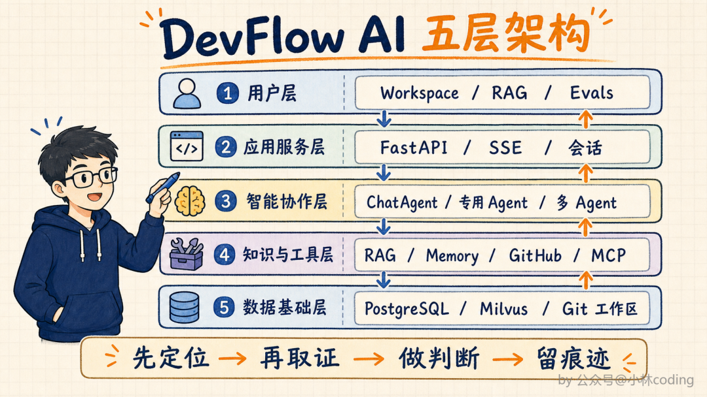
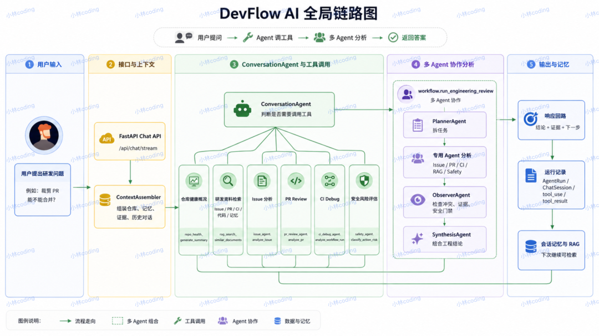
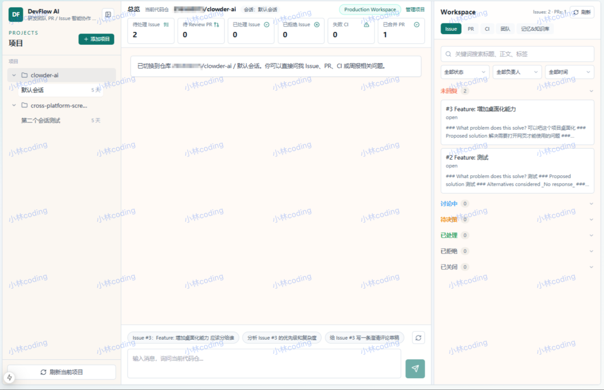

# DevFlow AI — 多智能体研发协作助手(端到端最小闭环 Demo)

一个能**分析 Issue、审查 PR、排查 CI 失败**的研发协作助手。你提一个研发问题,它会自己调用工具去查代码、翻日志、检索项目文档,需要综合判断时组织多个 Agent 分工分析,再把结论、依据和下一步建议整理给你 —— 而且写操作只出草稿,必须人工确认。
> 🧭 **还要配什么?请看 [配置清单](docs/配置清单.md)** —— 只列需要你动手的事,每步都写了怎么确认生效。
>
> 📖 **怎么用?请看 [操作手册](docs/操作手册.md)** —— 启动、界面导览、七个常用场景、模式切换、运维命令、故障排查,一页速查在最后。

> 本项目基于公众号「小林coding」的文章《面试官质疑:"你的Agent项目,不就是套了个 API?"》所介绍的 **DevFlow AI 多智能体研发协作项目** 实现。
> 原文归档与全部配图见 [`docs/refs/`](docs/refs/article-fulltext.md);**本 Demo 是功能范围内的独立实现,不是课程内容的搬运**。

## CI

`.github/workflows/ci.yml` 跑后端与前端单测。**不需要任何 Secret** ——
后端测试用 SQLite 内存库 + 进程内向量库,前端是纯组件测试,两边都刻意不联网、不打真实模型。

## 它解决什么问题

团队里判断一次改动能不能合,要先看 PR 改了什么,再翻 Issue 的需求和评审意见,还要看 CI 结果;出错了还得查日志、搜代码、找文档。这些信息散落在不同地方,光是**把背景和证据找齐**就要花很多时间。

DevFlow AI 把这条链路自动化:先定位 → 再取证 → 做判断 → 留痕迹。

| 环节 | 落在哪 | 怎么验证 |
|---|---|---|
| 先定位 | `core/context.py` ContextAssembler 组装仓库/会话/记忆/证据 | 对话流的 `context` 事件 |
| 再取证 | 10 个工具 + RAG 混合检索(RRF + 重排) | `/api/rag/recall-test` 四阶段 |
| 做判断 | ChatAgent 工具循环 + LangGraph 多 Agent 工作流 | `plan`/`task_*`/`observation` 事件 |
| 留痕迹 | AgentRun / WorkflowRun / TaskRun / ToolCall + AuditLog | `GET /api/runs/{id}` |

## 架构

五层架构(对应原文架构图):



一次请求的全局链路:



```
① 用户层        Next.js 工作台:Workspace / RAG 召回测试 / Evals
                        ↓ SSE ↑
② 应用服务层    FastAPI:Pydantic 校验 / SSE 事件流 / 会话与仓库范围
                        ↓
③ 智能协作层    ChatAgent(工具循环) ──需要综合判断──▶ 多 Agent 工作流
                     Planner → 专用 Agent(Issue/PR/CI/Safety) → Observer → Synthesis
                        ↓
④ 知识与工具层  RAG / Memory / GitHub / Workspace / MCP / Skill
                        ↓
⑤ 数据基础层    PostgreSQL(事实·状态·运行记录) / Milvus(向量) / 本地代码工作区
```

工作台界面复刻自原文流出的产品截图:



## Quick Start

前置:Docker Desktop 已启动,且能 `docker info` 返回版本号。

```bash
cp .env.example .env          # 默认 LLM_MODE=mock,无需任何密钥即可跑通
docker compose up -d --build
docker compose exec -T backend alembic upgrade head
```

首次启动时后端会自动装载内置研发数据快照并建立 Milvus 索引。然后打开:

- 工作台:<http://localhost:3000>
- RAG 召回测试:<http://localhost:3000/rag>
- Evals:<http://localhost:3000/evals>
- 后端 API 文档:<http://localhost:8000/docs>

## 验收

一条命令跑完全部验收(容器健康 + 后端单测 + 前端单测 + 全链路 HTTP):

```bash
pwsh -File scripts/verify.ps1      # Windows
./scripts/verify.sh                # POSIX
```

当前实测结果:

| 项 | mock 模式(默认) | 真实模型(deepseek-flash) |
|---|---|---|
| 后端单测 | 216 passed | 216 passed |
| 前端单测 | 23 passed | 23 passed |
| 全链路 HTTP 验收 | **FAIL=0** | **FAIL=0** |
| Agent Eval | 10/10 | **10/10** |

两种模式都是 40/40。切真实模型的过程暴露了 5 个 Mock 模式下发现不了的问题(思考模型的 `reasoning_content` 回传要求、`tool_choice` 限制、模型空手作答、工作流不触发、工作流超时),
完整记录在 [`docs/Plan-DevFlow-AI-Demo.md`](docs/Plan-DevFlow-AI-Demo.md) 末尾的「真实模型验收记录」。

手动试一下最关键的几条:

```bash
# 1. 总览六项统计(来自 PostgreSQL)
curl -s http://localhost:8000/api/repos/1/health

# 2. SSE 流式对话:应当逐事件打印,而不是攒完一次性吐出
curl -sN -X POST http://localhost:8000/api/chat/stream \
  -H 'Content-Type: application/json' \
  -d '{"session_id":"s1","repo_id":1,"message":"CI #512 为什么失败?","role":"member"}'

# 3. 多 Agent 工作流 + 冲突检测
curl -sN -X POST http://localhost:8000/api/chat/stream \
  -H 'Content-Type: application/json' \
  -d '{"session_id":"s2","repo_id":1,"message":"检查当前 Issue、PR 和失败 CI,判断这个版本是否可以发布","role":"member"}'

# 4. RAG 召回测试四阶段
curl -s -X POST http://localhost:8000/api/rag/recall-test \
  -H 'Content-Type: application/json' -d '{"repo_id":1,"query":"登录接口变更"}'

# 5. Agent Eval
curl -s -X POST http://localhost:8000/api/eval/run \
  -H 'Content-Type: application/json' -d '{"mode":"mock"}'
```

> Windows 提示:PowerShell 会把请求体里的中文按本地代码页编码,导致服务端收到乱码。
> 验收脚本 `scripts/verify_api.py` 用 Python 发请求就是为了绕开这个坑。

## 三个双模式开关

Demo 必须**离线可跑、可单测**,同时又能**接真实上游**。三处都由 `.env` 切换,默认全部离线:

| 开关 | `mock`(默认) | 真实模式 |
|---|---|---|
| `LLM_MODE` | `DeterministicChatModel`:按 Agent 角色确定性地产出**真实 tool_calls**,驱动完整的 Agent 循环与工作流 | `ChatOpenAI` → 任意 OpenAI 兼容端点(如 DeepSeek `https://api.deepseek.com/v1`) |
| `EMBED_MODE` | 确定性 hash 向量(可复现、共享词越多越相似) | OpenAI 兼容 Embedding 端点 |
| `DATA_SOURCE` | `snapshot`:内置快照,离线可复现 | `github`:GitHub REST 适配器(需自填 `GITHUB_TOKEN`) |

### 切到真实模型

```bash
# .env
LLM_MODE=openai
OPENAI_BASE_URL=https://api.deepseek.com/v1
OPENAI_API_KEY=sk-你的key
OPENAI_MODEL=deepseek-chat

docker compose up -d backend
```

真实模式下 `/api/eval/run` 的 `ragas` 字段不再显示 skipped。**未装 ragas 时会如实显示 `unavailable`**,不会用假数字充数。

### 切到真实 GitHub

```bash
# .env —— 两个都必须配
DATA_SOURCE=github
GITHUB_TOKEN=ghp_xxx
GITHUB_REPO=owner/name

docker compose up -d --force-recreate backend
```

启动时会同步 Issue / PR / CI,并**对失败的 CI 拉取日志**(GitHub 的日志接口返回 ZIP,需要解压)。

配置不全时(缺 token 或缺 `GITHUB_REPO`),后端**不装载任何数据**,界面显示空数据并给出提示,日志里有一条 ERROR —— 它**不会拿快照数据顶替**。静默回退会让人把假数据当成真实结论。

> 这条链路用 `httpx.MockTransport` 做了离线测试(分页 / 限流退避 / ETag / 日志解压 / sync 落库),见 `backend/tests/test_github.py`;
> 并且已用真实 PAT 端到端验证通过(2026-10-06):仓库创建、CI 运行入库、非成功结论的日志拉取。

**如果本机开着 GitHub 加速器(Steam++ / Watt Toolkit 等)**:容器会把 github 域名解析到 `127.0.0.1`(即容器自己)而连接失败,
且加速器做 TLS 中间人导致证书校验不过。叠加专用配置即可:

```powershell
pwsh -File scripts/enable-github-accelerator.ps1
```

它会导出加速器根证书并用 `docker-compose.accelerator.yml` 重建 backend。
⚠️ 这等于让容器信任一个本地中间人根证书,仅在直连 GitHub 不通时使用;`backend/certs/extra-ca/` 为空时行为与默认完全一致。

## 目录结构

```
backend/
  app/
    api/            # REST + SSE 接口
    agents/         # ChatAgent / 三个专用 Agent / LangGraph 工作流 / Planner / Observer / Synthesis
    tools/          # 10 个工具(其中只有 draft_action 涉及写操作,且只出草稿)
    rag/            # 结构感知切分 / 混合检索 / RRF / 重排 / 召回测试
    core/           # 配置 / LLM 双模式 / 上下文预算 / 记忆
    safety/         # 权限策略 / 草稿状态机 / 审计
    observability/  # SSE 事件 / 运行轨迹落库
    eval/           # 硬规则 + 评测执行器
    github/  mcp/  skills/
  data/snapshot/    # 内置研发数据(自洽的一条故事线)
  tests/            # 216 个单测,全 Mock(含 GitHub 适配器离线测试)
frontend/
  app/              # 工作台 / RAG 召回测试 / Evals
  components/       # 三栏工作台与执行轨迹渲染
  lib/              # SSE 解析(手写,处理半帧与多字节切断)
docker-compose.yml  # postgres + etcd + minio + milvus + backend + frontend
docs/               # 操作手册、Spec 与 Plan 文档、原文归档与配图
scripts/            # 端到端验收脚本
```

## 几个关键设计取舍

- **Mock 是真模型类,不是预录回放**。`DeterministicChatModel` 继承 `BaseChatModel` 并返回真实 `tool_calls`。用回放最省事,但那样 ChatAgent 的循环、步数上限、重复调用拦截、工具错误回灌**一次都不会被执行到**,单测等于没测。
- **模型没有直接执行写操作的通道**。工具注册表里写类工具**有且仅有** `draft_action`,有测试守着这个不变量。执行权留在人工确认环节。
- **代码永不进向量库**。代码天天变,向量库里的副本必然过期。当前代码只走 Workspace 工具直接读文件,历史文档才走 RAG。
- **上下文压缩顺序是契约**。先压工具结果(可重取)→ 再截证据(可按分数重取)→ 最后才动对话历史。顺序有测试锁死。
- **Observer 的冲突由硬规则算出**。「PR 说可合、CI 说失败」这类矛盾如果交给模型判断,大概率被和成一个「建议进一步确认」。
- **记忆必须人工批准才生效**。未批准的候选绝不参与召回,防止一次错误结论长期污染后续所有会话。
- **没有证据就说没有**。检索不到时返回空并明说「未找到」,不允许用低相关文档兜底。

## 已知限制

- **范围是「端到端最小闭环」**,不是原文 16 章、60+ 篇文档的完整课程复刻。原文目录(见 [`docs/refs/images/img_14.png`](docs/refs/images/img_14.png))只作为功能范围的依据。
- **不替用户改代码、不自动合并 PR**。原文明确 DevFlow AI 是协作型而非代码执行型 Agent。
- **鉴权是演示级**。角色(viewer/member/maintainer)由前端切换,只用于演示权限闸门,不做 SSO / 多租户 / 限流。
- **MCP 只实现了 inprocess transport**,stdio transport 留了接口未实现 —— 留空比假装实现更诚实。
- **Skill Runtime 是最小版**:YAML 声明 + 入参校验 + 顺序执行,没有 marketplace 和版本管理。
- **Ragas 只留了接入点**。mock 模式显式跳过;真实模型模式在未安装 ragas 时如实报告不可用。
- **镜像来自 DaoCloud 镜像源**(本机 `registry-1.docker.io` 直连不可达),compose 里写的是带源前缀的全名,换机器可能需要调整。